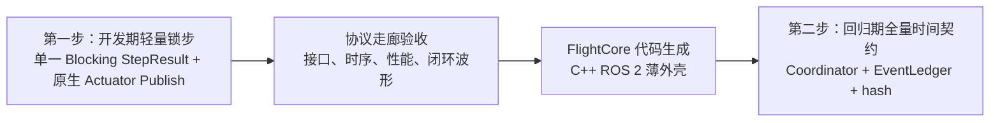
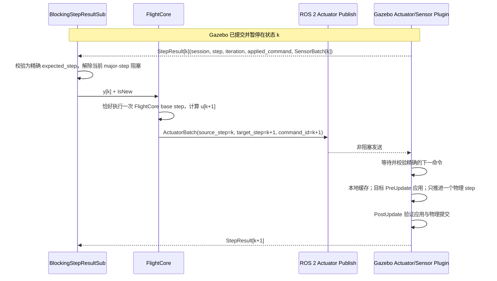
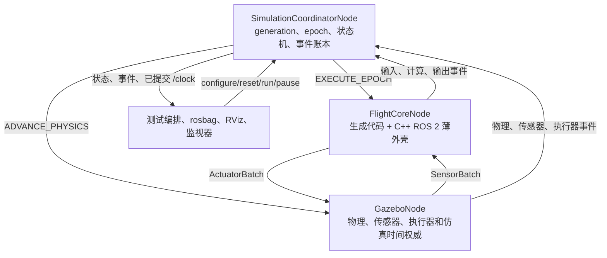
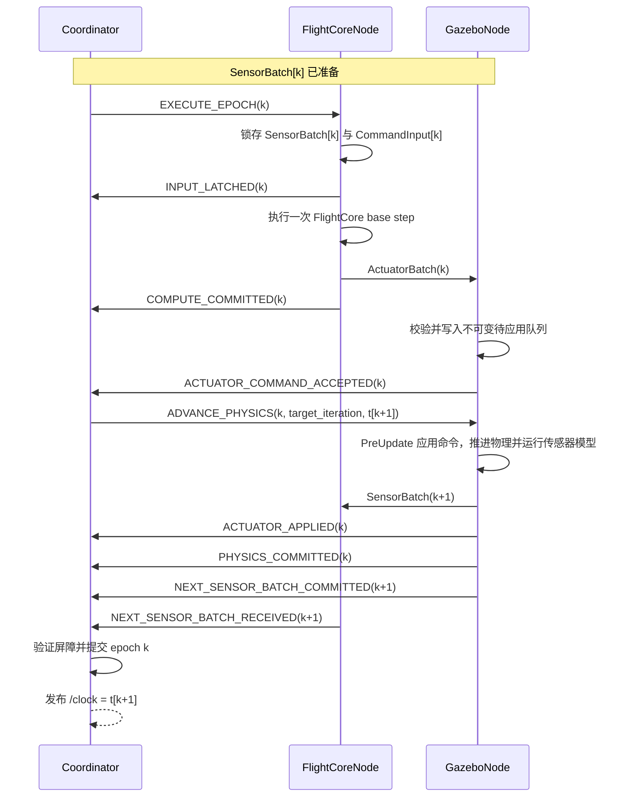

# UAVSingleFlightControl 联合仿真与确定性回归时间契约架构

> 状态：已确认（分层架构；轻量级阻塞事务方案于 2026-07-27 批准）  
> 日期：2026-07-27  
> 当前阶段：第一步——开发期轻量锁步联合仿真  
> 范围：Gazebo Harmonic 与当前 Simulink FlightCore 的联合仿真，以及 FlightCore 代码生成后的确定性回归时间契约  
> 非本文件范围：FlightCore 内部控制器、估计器和多速率算法设计；实时仿真、PIL、HIL 与硬件上板另行定义  

## 1. 总体裁决：为什么必须分两步

### 1.1 当前事实与目标差异

当前可执行的 FlightCore 形态是 Windows MATLAB 中的 `FlightCore_ROS2_loop.slx`。它适合模型开发、波形观察和参数调整，但不是一个能够稳定实现 epoch 单步入口、事件报告和事务恢复的独立 ROS 2 节点。

回归期需要的 `FlightCoreNode` 是另一种运行形态：

```text
FlightCore 生成代码
+ C++ ROS 2 薄外壳
= FlightCoreNode
```

两种运行形态对应不同目标：

| 目标 | 首要关注 | 可接受代价 |
|---|---|---|
| 日常联合仿真与算法调参 | 尽快跑通 Gazebo ↔ Simulink 闭环，保证逐步因果正确 | ROS 2 调度和线程顺序造成的墙钟抖动及小范围数值差异 |
| 确定性回归验证 | 每个物理步可审计、可归因、可重放，故障后不继续推进 | 更高实现复杂度和更慢运行速度 |

如果第一条闭环就要求完整 Coordinator、事件账本和 payload hash，会在 FlightCoreNode 尚不存在时提前建设终态基础设施，延迟联合仿真和算法调参。如果只采用自由运行的 ROS 2 数据交换，又无法保证执行器命令在对应 Gazebo `PreUpdate` 前已经进入插件队列，调参可能出现整拍错位。

因此本项目采用两步走：



### 1.2 两个阶段的架构定位

| 项目 | 第一步：开发期轻量锁步 | 第二步：回归期全量契约 |
|---|---|---|
| FlightCore 执行体 | `FlightCore_ROS2_loop.slx` | 生成代码 + C++ ROS 2 外壳 |
| Gazebo | Harmonic，paused；匹配命令是唯一单步许可 | Harmonic，paused，由 Coordinator 授权推进 |
| 同步主体 | Harness 层单一阻塞 `StepResult` S-Function 与 Gazebo 插件 | `SimulationCoordinatorNode` |
| 推进前保证 | Gazebo 本地验证并缓存精确匹配的下一命令 | `ACTUATOR_COMMAND_ACCEPTED` 进入事件账本 |
| 推进后保证 | 原子 `StepResult` 精确匹配 step、iteration 和 applied command | `ACTUATOR_APPLIED`、`PHYSICS_COMMITTED` 等屏障事件 |
| 身份 | `session_id + source_step_id + target_step_id + command_id` | `generation + epoch_id + producer_id + sequence` |
| 审计 | 有界诊断，不建全量账本 | ExpectedEvents、EventLedger、payload hash |
| 主要用途 | 接口贯通、控制调参、快速迭代 | 确定性回归、故障注入、严格追踪 |

第一步不是临时废弃原型。它必须使用与第二步一致的业务数据语义，使 Gazebo 插件、SensorBatch、ActuatorBatch、TimingProfile、场景和测试能够直接升级复用。

### 1.3 两个阶段共同遵守的不变量

- Gazebo 是模拟物理时间和物理状态的权威；墙钟只用于超时和性能统计。
- FlightCore 只消费和产生 InterfaceContract 数据，不出现 Gazebo、ROS 2、DDS、UDP、Coordinator 或日志 API。
- 执行器“已缓存”和“已物理应用”是两个不同事实，不得合并表述。
- 传感器新帧由身份、时间戳和 `available_sensor_mask` 决定，不按测量值是否变化推断。
- 未更新传感器可以保持上次值，但必须为 `IsNew = false`。
- 同一个控制 epoch 只能由一个原子观测事务解除 Simulink 阻塞；禁止用多个独立 topic 的到达顺序拼装 epoch 身份。
- 每个有效 ActuatorBatch 必须绑定其来源观测和唯一目标 step；Gazebo 对完全匹配的命令最多提交一个物理步。
- 运行 reset 后旧身份、旧命令、旧 ACK 和旧传感器批次全部失效。
- 超时或身份不明时不得继续物理推进，也不得静默沿用旧命令。
- 日志、rosbag、RViz、GUI 和可视化不参与物理推进屏障。

共同时间语义为：

| 时间 | 含义 | 权威产生者 |
|---|---|---|
| `t_sample` | 传感器测量代表的物理时刻 | Gazebo 传感器模型 |
| `t_available` | 该测量允许被 FlightCore 消费的物理时刻 | TimingProfile + Gazebo RuntimeAdapter |
| `t_input_latch` | FlightCore 锁存本轮输入的逻辑时刻 | FlightCore 执行外壳或 harness |
| `t_command_ready` | FlightCore 产生执行器输出的逻辑时刻 | FlightCore 执行外壳或 harness |
| `t_command_accept` | Gazebo 插件验证并缓存命令的逻辑时刻 | Gazebo 执行器插件 |
| `t_apply` | 命令开始作用于物理模型的时刻 | Gazebo `PreUpdate` |
| `t_phys_commit` | 本轮物理推进完成的时刻 | Gazebo `PostUpdate` |

必须保持：

```text
t_sample
≤ t_available
≤ t_input_latch
≤ t_command_ready
≤ t_command_accept
≤ t_apply
≤ t_phys_commit
```

## 2. 第一步：开发期轻量锁步联合仿真

### 2.1 当前拓扑与组件边界

```text
Gazebo Harmonic（WSL，paused）
    │  StepResult[k]：提交事实 + 原子 SensorBatch
    ▼
BlockingStepResultSub（Simulink harness 顶层，唯一阻塞点）
    ↕ InterfaceContract Bus
FlightCore_ROS2_loop.slx（Windows MATLAB）
    │  ActuatorBatch[k+1]：绑定 source_step=k
    ▼
Gazebo Actuator/Sensor Plugin
    └─ 校验、缓存、PreUpdate 应用、只推进一个物理 step
```

轻量级 Simulink participant 由单一 `BlockingStepResultSub` 和原生 ROS 2 Publish 组成：

- `BlockingStepResultSub` 在每个 base-rate major time hit 的 `Outputs` 内等待精确的下一 `StepResult`；函数返回前，Simulink 当前 major step 不能完成。
- `StepResult` 同时携带物理提交身份、实际应用命令身份和本 epoch 的稀疏 SensorBatch；IMU、GPS 等不得作为多个独立阻塞点。
- FlightCore 消费该原子批次，原生 Publish 在同一 major step 发送与来源观测绑定的 `ActuatorBatch`。
- Gazebo 插件是轻量级阶段的单步执行权威：只有接收并验证精确的下一命令后，才允许执行一次 PreUpdate → physics step → PostUpdate。
- 阻塞逻辑只能位于 Gazebo 专属 harness 或 RuntimeAdapter 边界，不得进入 FlightCore 产品模型。

模型以一次普通连续仿真运行完成整个 episode；禁止使用模型外
`step(simulationController, NumberOfSteps=1)` 作为逐 epoch 推进机制。

开发期明确不启动：

```text
SimulationCoordinatorNode
ExpectedEvents
EventLedger
payload hash
全量事件归因和中途恢复
```

开发期运行编排或可选健康监视器可以承担启动、reset 和故障观察，但不得进入每步数据路径，也不得成为 Simulink 继续执行所必需的第三个逐步 ACK。逐步正确性仅由
`StepResult[k] → ActuatorBatch[k+1] → Gazebo commit → StepResult[k+1]`
闭合。

### 2.2 RESET 与 PRIME

每次运行开始时：

```text
1. 运行编排创建新的 session_id
2. Gazebo reset 世界并保持 paused
3. Gazebo 插件清空执行器待应用队列和旧反馈
4. BlockingStepResultSub 清空旧 StepResult 和期望身份
5. Gazebo 设置安全执行器初值
6. Simulink participant 宣告订阅端已就绪
7. Gazebo 在 t0 生成并发布原子 StepResult[0]
8. BlockingStepResultSub 验证 session、step=0、iteration、sim_time 和传感器身份
9. FlightCore 获得 y[0]，进入 READY
```

初始必要传感器集合由 TimingProfile 定义。首版至少要求每个控制 epoch 有一个新 IMU；GPS 等低频传感器不作为每个 epoch 的必要输入。

### 2.3 单个 epoch 的阻塞事务



推进规则：

- `StepResult[k]` 是解除 Simulink 第 `k` 个 major time hit 阻塞的唯一事务；不得分别阻塞等待 IMU、GPS 或其他传感器 topic。
- Blocking S-Function 只接受当前 `session_id` 的精确 `expected_step`。历史重复可丢弃；未来 step、同身份冲突或时间不一致立即终止 episode。
- `ActuatorBatch[k+1]` 必须显式绑定 `source_step_id=k`、`target_step_id=k+1` 和唯一 `command_id`。
- Gazebo 插件只接受当前 session 的精确下一命令；缓存验证成功本身就是本步推进许可，不增加逐步 `COMMAND_CACHED` 往返。
- 插件只能在目标 step 的首个到期 `PreUpdate` 应用命令，并且只执行 TimingProfile 指定的一次 epoch 推进；应用和物理提交事实统一在 `PostUpdate` 生成的 `StepResult[k+1]` 中报告。
- `StepResult[k+1]` 必须满足 `step_id`、`target_iteration`、`sim_time`、`applied_command_id` 和 `applied_iteration` 全部与预期一致。
- 禁止只等待 `sensor_stamp >= t_target`，也禁止用多个 ROS 2 topic 的发布顺序或 Simulink block priority 推断它们属于同一物理步。

在 `t[k]` 的控制语义为：

```text
u[k]   = FlightCore(y[k])
x[k+1] = GazeboStep(x[k], u[k])
y[k+1] = SensorModel(x[k+1])
```

### 2.4 开发期最小接口

统一身份：

```text
session_id
source_step_id
target_step_id
command_id
valid_from_iteration
expected_iteration
```

开发期 `ActuatorBatch`：

```text
schema_version
session_id
source_step_id
target_step_id
command_id
valid_from_iteration
armed
valid
actuator_values[]
```

推进后 `StepResult`：

```text
schema_version
session_id
step_id
target_iteration
sim_time
applied_command_id
applied_iteration
applied_sim_time
available_sensor_mask
sensor_frames[]
status
```

轻量级逐步协议只有两条关键事务消息：

```text
StepResult[k] → Simulink
ActuatorBatch[k+1] → Gazebo
```

`StateEst`、日志和可视化话题是旁路输出，不参与解除阻塞或授权物理推进。

每个 SensorFrame 至少包含：

```text
source_id
source_sequence
sample_time
available_time
integration_interval
valid
status
payload
```

### 2.5 多速率传感器、命令与初始延迟范围

每个目标 epoch 只生成一个原子 `StepResult`，其中包含一个稀疏 SensorBatch，只携带本 epoch 首次到期可用的新帧：

```text
SensorBatch[k] = 必要高频新帧 + 本轮首次到期的低频新帧
```

`available_sensor_mask` 只表示本批次的新帧。GPS、磁力计等没有到采样周期时不属于错误；FlightCore 保持旧值但设置 `IsNew = false`。

因此低频 GPS 不建立第二个阻塞点。每个 epoch 由 base-rate `StepResult` 唯一驱动；GPS 到期时随该原子批次携带并设置 `gps_is_new=true`，未到期时保持旧值并设置 `gps_is_new=false`。

首版开发期冻结：

```text
L_compute   = 0
L_transport = 0
L_actuator  = 0
availability_delay = 0
```

非零模拟延迟和延迟观测融合只有在协议走廊跑通、FlightCore 对应 OOSM 能力通过测试后才能启用。实际 ROS 2 墙钟耗时不得隐式当作模拟延迟。

动态 CommandInput 是闭环因果输入：

- 人工或外部实时命令可用于交互调试，但该运行不声明可重复。
- 用于参数对比的运行必须使用按 `session_id + step_id` 预先脚本化的 CommandInput。
- FlightCmdBus 仍只通过 InterfaceContract 进入 FlightCore；调度身份保留在 harness 外壳，不渗入产品总线。

### 2.6 重复、超时和失败

- 旧 `session_id` 的命令、StepResult 和 SensorBatch 一律拒绝。
- 同一 `command_id` 且内容相同的重复消息可以幂等确认；同一身份但内容冲突时停止运行。
- BlockingStepResultSub 等待超时时，Simulink 终止当前 episode；不得跳过 expected step 或继续使用保持值计算。
- Gazebo 等待匹配 ActuatorBatch 超时时保持 paused，不跳步、不伪造结果、不沿用旧命令继续推进。
- 已经提交的 step 不执行协议级回滚；重启或恢复必须 reset 并创建新 `session_id`。
- reset 必须清空两侧缓存并创建新 `session_id`；首版不支持从中间 step 恢复。
- StepResult 和 ActuatorBatch 使用 Reliable、有界队列；禁止无上限积压和超时后追赶。
- 日志与可视化失败不得阻塞闭环，但必须记录为诊断状态。

### 2.7 性能测量与第一步验收

轻量级每 epoch 的墙钟开销近似为：

```text
T_epoch ≈ T_step_result_delivery
        + T_flightcore_compute
        + T_actuator_delivery
        + T_gazebo_step
```

第一步不承诺 1× 实时。运行速度慢只影响开发效率，不得改变 FlightCore 使用的物理 `dt`。

先完成 100 epoch 功能探针，再完成至少 1000 epoch 性能探针，记录：

```text
T_step_result_delivery
T_flightcore_compute
T_actuator_delivery
T_gazebo_step
T_epoch_total
```

每项统计 `mean`、`p50`、`p95`、`p99` 和 `max`。性能优化不得重新引入模型外逐拍 `simulation.step()`，也不得删除命令身份验证和推进后应用身份验证。

第一步通过条件：

- RESET/PRIME 后没有旧 session 数据进入新运行。
- 连续至少 1000 epoch 的 iteration 和 sim time 增量精确符合 TimingProfile。
- 每个 Simulink major time hit 只消费一个精确匹配的 StepResult。
- 每个 Gazebo 物理推进只由一个精确匹配的 ActuatorBatch 触发。
- 每个 StepResult 的 `applied_command_id` 和 `applied_iteration` 与预期一致。
- 满足 `Simulink major-step count = accepted command count = Gazebo committed-step count`。
- 没有重复消费 SensorFrame，没有把保持值标记为新帧。
- 超时情况下 Gazebo 保持 paused，物理时间不变。
- 已形成可重复使用的接口映射、坐标变换、电机顺序、TimingProfile 和性能基线。
- 在此基础上跑通 Gazebo ↔ Simulink 闭环，获得可用于算法调参的波形和指标。

第一步通过只证明协议走廊和调参闭环有效，不等于全量确定性回归通过。

## 3. 两阶段衔接与升级门

### 3.1 为什么第一步能够平滑升级

第一步已经建立第二步所需的物理因果骨架：

```text
原子 StepResult 阻塞输入
→ 输入锁存
→ FlightCore计算
→ 带来源身份的执行器命令
→ Gazebo本地验证并授权一次推进
→ PreUpdate实际应用
→ PostUpdate物理与传感器结果
→ 下一原子 StepResult
```

第二步不改变这条因果链，只增加独立调度权、双端事件报告、账本和审计。因此第一步的 Gazebo 插件、消息语义和测试资产可以保留。

### 3.2 资产与语义映射

| 第一步资产/语义 | 第二步对应项 | 升级方式 |
|---|---|---|
| `session_id` | `generation` | 扩展为 episode 生命周期身份 |
| `source_step_id + target_step_id` | `transaction_epoch_id + subject_epoch_id` | 保留单 epoch 单在途和跨步因果绑定 |
| Gazebo 本地命令验证 | `ACTUATOR_COMMAND_ACCEPTED` | 增加 EventReport、producer 和 payload hash |
| StepResult 中的实际应用字段 | `ACTUATOR_APPLIED` | 从本地回执升级为账本事件 |
| StepResult 中的物理结果 | `PHYSICS_COMMITTED` | 由 GazeboNode 向 Coordinator 报告 |
| 稀疏 SensorBatch | 回归期 SensorBatch | 增加 generation、目标 epoch、集合身份和 hash |
| BlockingStepResultSub 的 expected-step 判断 | Coordinator 的 ExpectedEvents + 状态机 | 从两方阻塞事务升级为独立提交权威 |
| Simulink harness 调用 FlightCore | C++ 薄外壳调用生成代码 | InterfaceContract 语义不变 |
| TimingProfile | 回归期 TimingProfile | 冻结版本并进入 episode 配置 |
| 脚本化 CommandInput | 确定性 CommandSchedule | 加入配置身份和 hash |

### 3.3 复用、替换与新增

直接复用：

- Gazebo Harmonic world、执行器插件、传感器插件和 PreUpdate/PostUpdate 记录点；
- 坐标系转换、电机顺序和 InterfaceContract 映射；
- SensorBatch、ActuatorBatch 的业务字段；
- TimingProfile、场景、随机种子和第一步测试数据；
- RESET、PRIME、命令缓存与实际应用分离语义。

需要替换：

- `FlightCore_ROS2_loop.slx` 的 harness 执行入口，替换为生成代码 + C++ ROS 2 薄外壳；
- BlockingStepResultSub 对 Simulink 逻辑推进的阻塞控制，替换为 Coordinator 的 `EXECUTE_EPOCH` 许可；
- Gazebo“收到匹配命令即推进”的本地许可，替换为 Coordinator 在 `ACTUATOR_COMMAND_ACCEPTED` 后发出的独立推进许可。

需要新增：

- SimulationCoordinatorNode；
- generation/epoch 全局身份；
- ExpectedEvents、EventLedger 和 EpochStateMachine；
- EventReport、规范化 payload hash 和双端交叉校验；
- `/clock` 的提交后发布；
- 确定性故障注入、归因和回归判据。

### 3.4 进入第二步的触发条件

只有同时满足以下条件，才进入全量时间契约实施：

1. 第一步协议走廊验收通过，Gazebo逐步因果、传感器和执行器映射稳定。
2. 单 BlockingStepResult 路径已证明无漏步、重步、旧观测消费或一命令多推进，Gazebo ↔ Simulink 能够完成算法调参和基础场景运行。
3. InterfaceContract、消息业务字段、TimingProfile 和 CommandInput 策略已经冻结。
4. FlightCore 能完成目标代码生成，并暴露明确的 reset、输入锁存和一次 base-step 执行入口。
5. C++ ROS 2 薄外壳能够在不引入 Gazebo/ROS 2 符号到 FlightCore 内部的前提下调用生成代码。
6. 第一阶段性能数据已经获得，可以据此配置回归期 watchdog，而不是预设墙钟阈值。

第二步是第一步的验证增强，不允许另建一套不兼容的数据模型。

## 4. 第二步：回归期全量确定性时间契约

### 4.1 三节点架构与职责



SimulationCoordinatorNode：

- 管理 episode、generation、epoch、ExpectedEvents 和 EventLedger；
- 发送执行与物理推进许可；
- 验证事件身份、顺序和时间关系；
- 只在当前 epoch 完整提交后发布 `/clock`；
- 处理超时、暂停、中止和全量 reset；
- 不转发或解释高频传感器、执行器 payload。

GazeboNode：

- 持有物理状态、sim time 和 iteration；
- 按 TimingProfile 采样传感器并管理 `available_time`；
- 接收、验证和缓存 ActuatorBatch；
- 在目标 `PreUpdate` 应用到期命令，在 `PostUpdate` 记录应用和物理事实；
- 直接向 FlightCoreNode 发送稀疏 SensorBatch；
- 向 Coordinator 报告因果关键事件；
- 物理更新回调内不得阻塞等待 ROS 2、FlightCore 或网络数据。

FlightCoreNode：

- 由 FlightCore 生成代码和 C++ ROS 2 薄外壳组成；桌面 Simulink 不承担该角色；
- 缓存 SensorBatch，按 `available_sensor_mask` 生成 `IsNew`；
- 收到 `EXECUTE_EPOCH` 后锁存本轮传感器和 CommandInput；
- 每次许可只执行一次约定的 FlightCore base step；
- 直接向 GazeboNode 发布 ActuatorBatch；
- 向 Coordinator 报告输入锁存、计算完成和输出身份。

### 4.2 Epoch、TimingProfile 与 PRIME

一个 epoch 定义为：

> 在 `t[k]` 锁存本轮到期输入，完成 FlightCore 计算，确认执行器命令进入 Gazebo 待应用队列，在目标 `PreUpdate` 应用命令，将物理状态推进到 `t[k+1]`，并生成下一 epoch 可消费的稀疏 SensorBatch。

```text
t[k+1] = t[k] + ΔT_epoch
ΔT_epoch = physics_iterations × Δt_physics
```

`ΔT_epoch`、`Δt_physics` 和 `physics_iterations` 属于版本化 TimingProfile，不是架构常量。当前协议走廊以 1 ms 控制 epoch 为目标，具体物理子步数由 Gazebo最小步进验证结果冻结。

首版模拟延迟仍为零：

```text
L_compute   = 0
L_transport = 0
L_actuator  = 0
availability_delay = 0
```

只有 FlightCore 的延迟观测处理能力通过独立测试后，TimingProfile 才能启用非零传感器可用延迟或 OOSM。

PRIME 顺序：

```text
1. Coordinator 创建新 generation
2. GazeboNode reset 并保持 paused
3. FlightCoreNode 清空输入、输出和内部运行状态
4. GazeboNode 设置安全执行器初值
5. GazeboNode 在 t0 生成必要初始传感器样本
6. SensorBatch[0] 被 FlightCoreNode 缓存
7. 双方 reset/prime 事件齐全
8. Coordinator 进入 READY
```

任意参与者重启都使当前 generation 作废，必须重新 RESET 和 PRIME。首版不支持从 epoch 中间恢复。

### 4.3 单个 epoch 与执行器时序



`ACTUATOR_COMMAND_ACCEPTED` 只证明身份、有效期和 payload 校验通过并已进入待应用队列。`ACTUATOR_APPLIED` 只能根据 Gazebo `PreUpdate` 的实际写入事实产生，并在对应 `PostUpdate` 后报告。WorldControl 请求成功不能替代 `ACTUATOR_APPLIED` 或 `PHYSICS_COMMITTED`。

非零执行器延迟启用后，Coordinator 根据 TimingProfile 生成每个 epoch 的 `due_actuator_apply_set`，只等待本 epoch 实际到期的命令；命令来源 epoch 不因延迟应用而改写。

### 4.4 多速率传感器与 CommandInput

每种传感器独立定义：

```text
source_id
sample_period
sample_phase
availability_delay_model
required_for_epoch
```

GazeboNode 在 `sample_time` 采样，在 `available_time` 之前保存在待释放队列，并在第一个满足以下条件的目标 epoch 中释放：

```text
t_input_latch[target_epoch] >= available_time
```

每个目标 epoch 恰好有一个稀疏 SensorBatch。低频传感器未到期不阻塞 epoch；建模丢样必须显式标记 `MODELED_DROP`，不能用消息缺失表达。

延迟帧保留原始 `sample_time` 和 `available_time`，只允许作为新帧消费一次。FlightCore 必须拥有 TimingProfile 所需的状态与观测历史；未具备 OOSM 能力时禁止启用对应非零延迟 profile。

确定性回归的 CommandInput 使用不可变、按 epoch 索引的 CommandSchedule：

- CommandSchedule 在 episode configure 时冻结并具有 `command_schedule_id` 和 payload hash；
- `EXECUTE_EPOCH` 指定本轮 `expected_command_id`；
- FlightCoreNode 在 `INPUT_LATCHED` 时同时锁存 SensorBatch 和对应 CommandInput；
- 迟到外部命令不得修改已打开或已提交 epoch；
- 需要人工实时操纵的运行属于开发模式，不声明确定性回归。

### 4.5 回归期接口与事件账本

`ExecuteEpoch`：

```text
generation
epoch_id
t_epoch
expected_available_set_id
expected_command_id
timing_profile_id
command_schedule_id
```

`AdvancePhysics`：

```text
generation
transaction_epoch_id
t_begin
t_target
target_iteration
physics_iterations
actuator_command_id
```

`SensorBatch`：

```text
schema_version
generation
target_epoch_id
batch_sequence
expected_available_set_id
available_sensor_mask
sensor_frames[]
payload_hash
```

`ActuatorBatch`：

```text
schema_version
generation
command_epoch_id
command_id
command_ready_time
valid_from_time
valid_from_iteration
deadline_time
armed
valid
actuator_values[]
payload_hash
```

统一 `EventReport`：

```text
schema_version
generation
transaction_epoch_id
event_type
producer_id
sequence
event_time
related_data_id
subject_epoch_id
payload_hash
status
error_code
```

事件唯一键：

```text
EventKey = generation
         + transaction_epoch_id
         + event_type
         + producer_id
         + sequence
```

Coordinator 为每个 epoch 保存：

```text
EpochRecord {
    generation
    epoch_id
    t_begin
    t_end
    phase
    expected_events[]
    observed_events[]
    failure_reason
}
```

正常 epoch 的基准屏障事件：

```text
INPUT_LATCHED
COMPUTE_COMMITTED
ACTUATOR_COMMAND_ACCEPTED
ACTUATOR_APPLIED
PHYSICS_COMMITTED
NEXT_SENSOR_BATCH_COMMITTED
NEXT_SENSOR_BATCH_RECEIVED
```

下一 SensorBatch 的两个事件关闭当前推进事务，但数据属于下一目标 epoch：

```text
transaction_epoch_id = k
subject_epoch_id     = k+1
```

Coordinator 不接收高频 payload，通过发送端和接收端声明的 `related_data_id + payload_hash` 交叉核对一致性。规范化序列化和 hash 算法必须按 `schema_version` 冻结。

事件合法状态：

```text
EXPECTED
REPORTED
COMMITTED
MODELED_DROP
REJECTED
FAILED
```

同一 EventKey 且内容完全一致时按幂等重复处理；同一 EventKey 的身份关联、payload hash、状态或错误码冲突时中止 episode。

### 4.6 QoS、排序、`/clock` 与消息窗口

调度、ACK 和事件通道初始使用：

```text
Reliability：Reliable
Durability：Volatile
History：KeepLast
Depth：4～8
```

高频数据通道必须 Reliable、有界、单 epoch 单有效批次，禁止无上限缓存。若 ROS 2 payload 成为瓶颈，可以替换为共享内存，但消息身份、三节点职责和 epoch 契约不变。

Coordinator 不使用 callback 到达顺序表示物理顺序，而按固定事件优先级归档。当前合法窗口只允许正在处理的事务和该事务预期的下一 SensorBatch；更远未来消息拒绝，历史重复只允许与已提交记录完全一致。

只有 Coordinator 发布当前 episode 的 `/clock`：

```text
PHYSICS_COMMITTED(t[k+1])
→ 屏障验证
→ epoch提交
→ /clock = t[k+1]
```

必须保持：

```text
t_clock ≤ t_phys_committed
```

禁止按墙钟推算 `/clock`、提前发布目标时间或由 GazeboNode/FlightCoreNode自行发布本 episode 的 `/clock`。

### 4.7 状态机、超时与确定性边界

主状态机：

```text
UNCONFIGURED
→ CONFIGURED
→ RESETTING
→ PRIMING
→ READY
→ OPEN_EPOCH
→ WAIT_INPUT_LATCH
→ WAIT_COMPUTE
→ WAIT_ACTUATOR_ACCEPT
→ WAIT_PHYSICS_RESULT
→ WAIT_NEXT_SENSOR
→ COMMIT_EPOCH
→ OPEN_EPOCH
```

异常和结束状态：

```text
PAUSED
PAUSED_ERROR
ABORTING
ABORTED
FINALIZING
COMPLETED
```

墙钟超时只触发 `PAUSED_ERROR`，不推进仿真时间。随后只能查询状态、中止 episode，或全量 reset 并产生新 generation。禁止超时后跳过 epoch、伪造事件、沿用旧命令或继续积分。

确定性需要冻结：

- Gazebo、物理引擎和插件版本；
- 编译选项、参数、随机种子和初始状态；
- TimingProfile、CommandSchedule 和事件排序规则；
- schema、规范化序列化和 hash 算法。

同一冻结环境应得到相同事件轨迹、输入输出身份序列和物理 step 数量，数值轨迹逐点一致或满足严格容差。跨机器、跨 ISA 或跨 Gazebo 版本不承诺位级一致，改用状态轨迹、关键指标和统计容差。

## 5. 实施顺序、验收与最终边界

### 5.1 当前实施顺序

```text
G1  Gazebo最小垂直步进验证
    paused启动、固定max_step_size、PreUpdate/PostUpdate、iteration/sim_time

G2  脚本版轻量协议走廊
    RESET/PRIME、ActuatorBatch、Gazebo单命令单步提交、原子StepResult

G3  Simulink harness联合仿真
    BlockingStepResultSub + 原生Actuator Publish接入FlightCore_ROS2_loop，
    单次普通仿真连续运行，跑通闭环和算法调参

G4  第一阶段资产冻结
    InterfaceContract、TimingProfile、消息schema、CommandInput和性能基线

G5  FlightCore代码生成与C++薄外壳
    reset、输入锁存、一次base-step执行、输出和事件报告

G6  全量Coordinator回归床
    generation、ExpectedEvents、EventLedger、hash、/clock和故障注入
```

Gazebo Harmonic 是当前主 Plant 路线；AirSim 路线已经冻结。旧开发计划中“Gazebo需等待AirSim P4解冻”的门控不适用于本架构，仓库入口与开发计划应另行同步到当前裁决。

### 5.2 第一步验收重点

- 1000 epoch 无漏步、重步、跨 session 数据和命令错拍。
- 一个 epoch 只有一个原子 StepResult 解除 Simulink 阻塞；不通过独立 IMU/GPS topic 到达顺序拼装观测。
- 每个 ActuatorBatch 显式绑定来源观测和唯一目标 step；Gazebo 对匹配命令只提交一次物理推进。
- `Simulink major-step count = accepted command count = Gazebo committed-step count`。
- 实际应用 command、iteration 和 sim time 与每步预期一致。
- 稀疏传感器批次、`IsNew` 和原始采样时间语义正确。
- timeout 后 Gazebo 保持 paused，物理时间不变。
- 在延迟、重复、历史和未来消息注入下，只允许等待、丢弃历史重复或终止，不允许错步继续。
- 记录 StepResult 传输、FlightCore 计算、ActuatorBatch 传输、Gazebo step 和总 epoch 的延迟统计。
- 闭环波形足以支持控制器和估计器调参，但不要求事件账本或位级重复。

### 5.3 第二步验收重点

协议正确性：

- 任意时刻最多一个 OPEN epoch；缺少任一必要事件不得推进。
- 不接受跨 generation、错误 epoch 或同身份不同 payload 的数据。
- `ACTUATOR_COMMAND_ACCEPTED` 后才允许推进；`ACTUATOR_APPLIED` 必须来自实际更新回调。
- `/clock` 不超过 Gazebo 已提交时间。

时间与多速率：

- 自动检查完整时间因果链。
- 低频传感器无新帧时不阻塞正常 epoch。
- 延迟帧不提前释放且只作为新帧消费一次。
- 必要传感器缺失或基础设施故障停止 episode；建模丢样使用 `MODELED_DROP`。

重复性与故障：

- 相同配置和随机种子得到一致的事件账本 hash、批次身份和命令身份序列。
- 状态轨迹满足冻结数值容差。
- 覆盖参与者不响应、重复/迟到/未来事件、错误身份、payload冲突、节点重启和 PRIME失败。
- 所有基础设施错误都停止物理推进。

### 5.4 最终架构边界

第一步解决：

> 当前 Simulink FlightCore 如何以足够轻量、因果可信的方式与 Gazebo Harmonic 联合仿真，从而尽早开展算法调参。

第二步解决：

> FlightCore 生成代码具备稳定运行外壳后，如何把相同的物理因果链升级为可审计、可归因、可重复的确定性回归验证床。

最终关系保持为：

```text
GazeboNode     ──SensorBatch────▶ FlightCoreNode
GazeboNode     ◀─ActuatorBatch─── FlightCoreNode

GazeboNode     ──EventReport────▶ SimulationCoordinatorNode
FlightCoreNode ──EventReport────▶ SimulationCoordinatorNode

SimulationCoordinatorNode ──调度许可──▶ GazeboNode、FlightCoreNode
```

分两步不是降低最终验证标准，而是按照当前可执行形态安排正确顺序：先用最小同步机制验证闭环和冻结业务契约，再在不推翻第一步资产的前提下增加代码生成外壳、全局提交权威和审计能力。

### 5.5 轻量级阻塞事务决策记录

2026-07-27 批准将引擎内阻塞方案纳入第一步轻量级框架，裁决如下：

- 批准使用阻塞 ROS 2 Subscribe S-Function 反压 Simulink major step；
- 否决分别使用 Blocking IMU Sub 和 Blocking GPS Sub 拼装同一 epoch；
- 第一阶段唯一时间屏障为单一 `BlockingStepResultSub`，其输入是带事务身份的原子 `StepResult`；
- FlightCore 输出通过原生 ROS 2 Publish 发送带来源观测和目标 step 身份的 `ActuatorBatch`；
- Gazebo 对完全匹配的下一命令只提交一次物理推进，并在 PostUpdate 后发布下一 `StepResult`；
- 不采用模型外逐拍 `simulation.step()`，不在轻量级框架中引入 EventLedger、payload hash 或每步第三方 Coordinator ACK。

本节和第 2 节取代
`docs/design/lockstep_ros2_blocking_sub.md`
中“双 Blocking IMU/GPS Sub 依靠发布与读取顺序保持一致”的设计；该设计文档仍可作为 Level-2 MATLAB S-Function 阻塞实现的参考来源，但不再是轻量级时间事务的权威定义。

正式实现为
`FC_SimulinkProject/3_Integration/Gazebo/BlockingStepResultSubscriber.m`：
它使用 Level-2 MATLAB S-Function 的 `Outputs` 方法调用 ROS 2 `receive()`，
在精确 StepResult 到达前阻塞当前仿真执行；可视化身份校验位于普通
`BlockingStepResult` 子系统中。该路线已经通过 100、1000 和 15000 步
计数恒等式与闭环验收。
