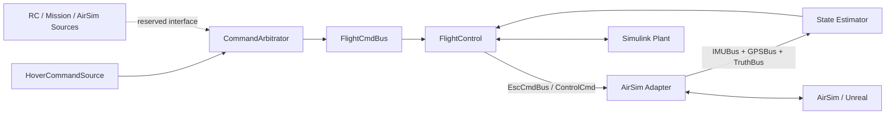

# 外部仿真整机闭环执行计划（Isaac Sim / Pegasus 优先，AirSim 备选）

> 归档声明：本文是 2026-06-23 前后的历史计划，已被 2026-07-07 架构审计后的 [../../DEVELOPMENT_PLAN.md](../../DEVELOPMENT_PLAN.md) 取代。本文可作为历史参考，不再作为当前执行权威。

> 项目：30 kg 级四旋翼无人机自研飞控系统  
> 制定日期：2026-06-22  
> 基线更新：2026-06-23  
> 目标：建立可同时面向 Isaac Sim / Pegasus、AirSim、ROS2 和上板 HAL 的飞控运行时适配架构。Isaac Sim / Pegasus 为长期优先路线，AirSim 降级为备选或快速验证工具；Simulink 闭环作为当前过渡验证后端。

## 0. 2026-06-23 架构决策更新

### 0.1 决策

后续外部仿真主线调整为：

```text
FlightCore + InterfaceContract + RuntimeAdapter
```

仿真器优先级：

```text
Isaac Sim / Pegasus > AirSim > Simulink InternalSim
```

其中：

- **Isaac Sim**：通用机器人仿真底座，提供 USD 场景、物理、渲染、传感器、ROS2 Bridge。
- **Pegasus**：Isaac Sim 上的无人机/多旋翼仿真扩展，用于 vehicle、航空传感器、PX4/MAVLink/ROS2 集成。
- **AirSim**：备选 RuntimeAdapter，用于快速验证和兼容性实验。
- **Simulink InternalSim**：当前过渡后端，用于算法、接口契约、短时闭环和回归测试。

### 0.2 架构原则

FlightCore 不直接依赖 Isaac Sim、Pegasus、AirSim 或 Simulink 动力学模型。所有外部环境都通过 RuntimeAdapter 接入。

隔离边界以 `docs/architecture/flightcore_runtime_isolation.md` 为准。本文是外部仿真执行计划，不再作为 FlightCore 边界的唯一来源；若本文和隔离契约冲突，以隔离契约为准。

```text
RuntimeAdapter -> SensorInput / CommandInput / EstimatorInit -> FlightCore
FlightCore -> ActuatorOutput / Telemetry -> RuntimeAdapter
```

稳定接口契约包括：

```text
SensorInput:
  IMU, GPS, Baro, Mag, Airspeed, TimeSync

CommandInput:
  Arm/Disarm, Mode, Position/Velocity/Attitude setpoint, Mission item

ActuatorOutput:
  Motor command, Servo command

EstimatorInit / InitContext:
  pos0, vel0, quat0, gyro_bias0, accel_bias0, covariance0, origin_lla, valid, source

VehicleState / Telemetry:
  state estimate, controller status, health/failsafe, debug truth comparison
```

### 0.3 对旧 AirSim 计划的处理

本文后续章节中原有 AirSim P0/P1/P2 路线保留为备选执行路径，但不再代表项目长期主线。新的主线应优先补充 IsaacSim/PegasusAdapter 设计：

```text
PegasusAdapter:
  Isaac Sim / Pegasus sensor and vehicle state
  -> SensorInput / TruthBus
  FlightCore ActuatorOutput
  -> Pegasus vehicle control / MAVLink / ROS2 bridge
```

AirSimAdapter 仅需实现同一套接口契约，不能把 AirSim API 泄漏到 FlightCore。

## 1. 执行结论

当前最快可行路线是先完成解耦命令链和纯 Simulink 悬停基线，再接入 AirSim。闭环“更新编译通过”只是入口条件，不等于悬停验收完成：

1. 建立 `HoverCommandSource → CommandArbitrator → FlightCmdBus → FlightControl` 解耦命令链。
2. 配置独立的仿真初始状态，完成平衡点悬停和起飞至 2 m 两级纯 Simulink 验收。
3. 使用 AirSim 进行场景渲染和位姿同步，获得 P0 整机飞行效果。
4. 将传感器和动力学逐步替换为 AirSim，实现 P1/P2 闭环。

当前项目已经具备完整闭环骨架：

```text
Controller → PowerSystem → Dynamics → Sensor → Estimator → Controller
```

对应顶层模型为 `FC_SimulinkProject/3_Integration/UAV_FC_loop.slx`。

当前执行焦点不是 AirSim Bridge，而是补齐闭环前端的命令接口和可重复悬停场景。

## 2. 当前项目状态与阻塞

### 2.1 已具备的基础

- 飞控串级控制链已建立：位置、速度、姿态、角速率和混控。
- 六自由度动力学模型已建立。
- 动力系统模型已建立。
- EKF 作为当前唯一集成与验收算法；ESKF、UKF 暂不进入闭环主线。
- IMU、GPS 传感器模型已有基本框架。
- `UAV_FC_loop.slx` 已通过 Model Reference 连接五个核心子系统。
- `UAV_FlightControl`、`EKF` 与顶层均已统一为定步长离散求解器；顶层基准步长为 `0.001 s`。
- Vehicle、DynamicModel、PowerSystem 字典的陈旧重复参数已清除。
- EKF 调度周期已使用 double 表达，数值计算边界继续保持 single。
- GPS→EKF、Controller→PowerSystem、PowerSystem→Dynamics 三处跨速率边界已加入确定性 Rate Transition。
- `test_flight_control_integration`、`test_sensor_sample_time_contract`、`test_ekf_integration` 已通过，输出 `CLOSED_LOOP_COMPILE_GATE_PASS`。
- Simulink Agentic Toolkit 已安装在：
  `C:\Users\89447\.matlab\agentic-toolkits\simulink`。

### 2.2 当前缺口与风险

1. `UAV_FlightControl` 目前只有 `StateEstBus` 输入，位置目标仍隐藏在控制器内部，尚无独立命令接口。
2. 尚未建立 `FlightCmdBus`、悬停命令源和命令仲裁层。
3. 动力学初始状态与 EKF 初始状态尚未由统一仿真场景参数驱动。
4. 更新编译已通过，但尚未证明 10 s 数值闭环稳定。
5. 传感器输出 Bus 尚未形成统一 `Valid/Timestamp` 契约；当前 EKF 仍存在用 GPS `Lat` 变化判断更新的临时逻辑。
6. IMU `AccelTrue` 与 GPS `Ned2Lla` 参数引用尚未收口；首轮悬停可使用理想传感器隔离该风险。
7. 当前仓库没有 AirSim 接口、配置或测试代码。
8. 项目根目录不是 Git 仓库，二进制模型修改缺少可靠回退能力。

### 2.3 当前唯一主线

```text
命令接口契约
→ 初版命令模块
→ 仿真初始状态
→ 传感器 Valid/Timestamp 契约
→ 10 s 平衡点悬停
→ 起飞至 2 m
→ P0 AirSim 位姿同步
```

ESKF/UKF、飞行模式全集、故障安全和真实传感器误差模型暂不进入该主线。

## 3. 目标分级

| 级别 | 闭环形态 | 预计周期 | 交付结果 |
|---|---|---:|---|
| P-1 | 纯 Simulink 命令链与悬停基线 | 1～3 天 | 平衡点悬停及起飞至 2 m 可重复运行，并有自动判据 |
| P0 | Simulink 计算动力学，AirSim 同步位姿与场景 | 1～2 天 | 飞行器在 AirSim 场景中按 Simulink 闭环结果运动 |
| P1 | AirSim 提供 IMU/GPS，Simulink 完成估计与控制 | 3～5 天 | AirSim 传感器进入自研估计与控制链 |
| P2 | Simulink 四路电机指令驱动 AirSim 四旋翼动力学 | 3～7 天 | 四旋翼执行器级整机闭环 |

### 3.1 AirSim 四旋翼适配条件

AirSim 官方 Python 低层接口 `moveByMotorPWMsAsync` 接收四路电机 PWM，和本项目修正后的四旋翼构型匹配。P2 不再需要扩展 AirSim RPC，但必须确认项目电机编号与 AirSim 参数顺序一致：

```text
front_right, rear_left, front_left, rear_right
```

因此：

- P0 可以直接实现。
- P1 可以使用官方传感器 API 实现。
- P2 可直接使用官方四路 PWM API；无需维护 AirSim fork。

## 4. 推荐总体架构



顶层应通过 Variant Subsystem 支持三种运行模式：

```text
PlantMode = Simulink
PlantMode = AirSimVisual
PlantMode = AirSimPhysics
```

控制器、估计器和 Bus 定义保持稳定；AirSim 只通过 Adapter 边界接入，避免仿真平台细节渗入飞控算法模型。

命令模块同样遵守稳定边界：命令源不了解 FlightControl，FlightControl 不了解命令来源，CommandArbitrator 只负责选择、有效性和安全默认值，不生成轨迹也不执行控制律。

## 5. 分阶段执行步骤

### 阶段 0：MATLAB/MCP 与闭环编译基线（已完成）

#### 0.1 正确启动 MATLAB

```powershell
Start-Process -FilePath 'D:\MATLAB\R2025b\bin\matlab.exe' `
  -ArgumentList '-desktop' `
  -WorkingDirectory 'D:\Project\UAVSingleFlightControl\FC_SimulinkProject'
```

#### 0.2 打开工程并初始化 Toolkit

在 MATLAB 中执行：

```matlab
openProject('D:\Project\UAVSingleFlightControl\FC_SimulinkProject\FC_SimulinkProject.prj');

addpath(fullfile(getenv('USERPROFILE'), ...
    '.matlab', 'agentic-toolkits', 'simulink'));

satk_initialize;
validate_installation;
```

#### 0.3 验证 MCP

```powershell
validate_installation
```

依次验证 MCP 工具：

1. `model_overview`：读取 `UAV_FC_loop` 顶层结构。
2. `model_read`：检查五个 Model Reference 的端口和 Bus。
3. `model_query_params`：检查 solver、固定步长和模型引用模式。
4. 如果当前 MCP 客户端暴露 `evaluate_matlab_code`，用它执行模型更新或短时仿真。
5. `model_test`：运行最小测试。

#### 阶段验收

- [x] MATLAB R2025b 正常运行。
- [x] `FC_SimulinkProject.prj` 可正常打开。
- [x] `validate_installation` 显示 `Result: PASS`，并报告动态连接器端口。
- [x] EKF、FlightControl、Sensor 和 `UAV_FC_loop` 更新编译门禁通过。
- [x] 定步长、调度精度和跨速率契约已固化到回归测试。

### 阶段 1：建立命令链与纯 Simulink 悬停基线（当前阶段）

这一阶段只解决“飞控能否稳定闭环”，不引入 AirSim。

#### 1.1 冻结集成基线

当前阶段只使用 `EKF.slx`：

1. `UAV_FC_loop/Estimator` 固定引用 `EKF.slx`。
2. EKF 输入为 `IMU_BUS + GPS_BUS`，输出为 `StateEstBus + Covariance`。
3. ESKF、UKF 不进入当前闭环、AirSim 联调和验收范围。

阶段 1 期间不得同时替换估计算法、重构动力学或引入 AirSim，以免失去单变量验证条件。

#### 1.2 工作包 A：定义命令接口契约（0.5 天）

新增 `FlightCmdBus`，首版至少表达：

```text
Position_NED_SP : single[3]
Velocity_NED_SP : single[3]
Yaw_SP          : single
Mode            : uint8
Valid           : boolean
```

约束：

- Bus 只在 `1_Data_Dictionaries/BusConfig/` 维护，并由 `create_GlobalTypes()` 生成。
- `FlightCmdBus` 不包含仿真初始状态、AirSim 连接信息或控制器内部状态。
- 首版只支持位置保持语义；姿态/角速率直接控制模式后续扩展，不提前塞入未使用字段。

验收：总线生成、字段类型和消费者接口测试通过。

#### 1.3 工作包 B：建立解耦命令模块（0.5～1 天）

建议目录：

```text
FC_SimulinkProject/2_Model/command/
├── CommandGenerator.slx
├── CommandDict.sldd
├── create_CommandDict.m
└── refactor_CommandGenerator.m
```

内部边界：

```text
HoverCommandSource → CommandArbitrator → FlightCmdBus
```

- `HoverCommandSource`：只从 CommandDict 读取悬停目标并形成候选命令。
- `CommandArbitrator`：只做来源选择、Valid 检查和无效时安全默认值。
- RC、Mission、AirSim 来源首版不实现功能，只在设计中预留可替换接口，不创建空壳业务逻辑。
- `UAV_FlightControl` 改为 `StateEstBus + FlightCmdBus → EscCmdBus`，删除位置环内部隐含零目标。

验收：命令模块可独立更新编译；FlightControl 不引用 CommandDict，也不知道命令来源。

#### 1.4 工作包 C：建立仿真场景参数（0.5 天）

新建独立 `SimulationDict` 或等价仿真场景参数源，至少包含：

```text
SIM_INIT_POS_NED
SIM_INIT_VEL_NED
SIM_INIT_QUAT
SIM_INIT_RATE_BODY
SIM_HOVER_POS_NED
SIM_HOVER_YAW
SIM_STOP_TIME
```

- 动力学积分器初值与 EKF 初始状态必须来自同一场景定义。
- CommandDict 不持有动力学或估计器初值。
- 首个场景采用平衡点悬停：初始位置与目标位置均为 `[0,0,-2] m`。

验收：重置仿真后 Truth、EKF 与命令目标在初始时刻一致。

#### 1.5 工作包 D：传感器输出契约与简化传感器

- 首轮使用理想 IMU/GPS。
- 关闭噪声、偏置、延迟和丢包。
- `IMU_BUS`、`GPS_BUS` 以及后续传感器 Bus 统一携带 `Valid` 与 `Timestamp`。
- `Valid` 表示该帧测量是否可信、可用于融合；`Timestamp` 表示传感器采样时刻。
- 如需更稳的新样本检测，可增加 `Sequence:uint32` 或 `NewSample:boolean`。
- EKF 不得再通过 `Lat` 等测量值变化判断新样本；GPS 更新门控使用 `GPS_BUS.Valid && Timestamp/Sequence 新样本到达`。
- IMU 预测路径检查 `IMU_BUS.Valid`，无效输入进入估计器状态与监控输出。

#### 1.6 工作包 E：保持既有仿真时基

- 顶层固定步长保持 `0.001 s`，本阶段不重新选型。
- EKF/Controller 快速路径保持 `0.001 s`。
- PowerSystem 保持 `0.005 s`。
- GPS 保持 `0.2 s`，通过已建立的 Rate Transition 进入 EKF。
- 新增命令模块必须使用明确且与消费者兼容的离散采样时间。

#### 1.7 工作包 F：两级悬停验收（0.5～1.5 天）

**F1：10 s 平衡点悬停**

```text
初始位置：[0, 0, -2] m
目标位置：[0, 0, -2] m
目标航向：0 rad
环境：无风、理想传感器
```

**F2：起飞至 2 m**

```text
初始位置：[0, 0, 0] m
目标位置：[0, 0, -2] m
目标航向：0 rad
环境：无风、理想传感器
```

自动判据：

- 模型编译无错误。
- 关键 Bus 无 NaN/Inf。
- 四路 ESC 指令均在合法范围内。
- 姿态和角速率不发散。
- 平衡点悬停 10 s 内高度误差有界；具体阈值在首次有效波形后冻结。
- 起飞工况能够接近目标高度且不发生持续发散。
- 四元数模长保持接近 1。

只有 F1、F2 均通过，才允许进入阶段 2。

### 阶段 2：建立 AirSim 接入边界

建议目录：

```text
FC_SimulinkProject/3_Integration/AirSim/
├── AirSim_FC_loop.slx
├── AirSimBridge/
│   ├── airsim_bridge.py
│   ├── protocol.py
│   └── smoke_test.py
├── config/
│   └── settings.json
└── tests/
    └── test_coordinate_transform.m
```

模块职责：

| 模块 | 职责 |
|---|---|
| `AirSim_FC_loop.slx` | AirSim 联调顶层，不污染纯 Simulink 基线 |
| `airsim_bridge.py` | AirSim RPC 连接、状态读取和控制写入 |
| `protocol.py` | 定义 Simulink 与 Python 之间的数据结构 |
| `settings.json` | AirSim 车辆、传感器、时间和网络配置 |
| `test_coordinate_transform.m` | 验证 NED、机体系和四元数转换 |

首版 Bridge 推荐采用外部 Python 进程，并通过 UDP 或 TCP 与 Simulink 通信。相比在 MATLAB Function 中直接调用 Python，这种方式边界清晰、便于独立测试，也更适合后续代码生成替换。

### 阶段 3：实现 P0 位姿同步

AirSim 暂不参与动力学计算：

1. Python Bridge 连接 `127.0.0.1:41451`。
2. Simulink 输出 `DynamicModelBus` 真值。
3. Bridge 将位置和姿态转换为 AirSim NED 表达。
4. 调用 `simSetVehiclePose` 同步 AirSim 飞行器位姿。
5. AirSim 负责场景、摄像机、碰撞和图像输出。
6. 飞控闭环仍完整运行在 Simulink 中。

#### P0 验收

- AirSim 轨迹与 Simulink 位置一致。
- 横滚、俯仰、航向的方向和符号正确。
- 重置后两端初始状态一致。
- 连续运行 60 s 无明显时间漂移。
- AirSim 场景中能够完成起飞和定高悬停。

### 阶段 4：实现 P1 AirSim 传感器闭环

#### 4.1 配置传感器

在 `settings.json` 中启用：

- IMU
- GPS
- Magnetometer（后续）
- Barometer（后续）

首轮关闭或降低噪声与延迟，先验证数据链；稳定后再逐步恢复真实误差模型。

#### 4.2 建立坐标与时间契约

必须明确并测试：

- AirSim 世界坐标：NED。
- 项目动力学世界坐标定义。
- 项目机体系是 FRD 还是 FLU。
- 四元数顺序是 `[w,x,y,z]` 还是 `[x,y,z,w]`。
- GPS LLA 与本地 NED 原点转换。
- 角速度和加速度所属坐标系。
- AirSim 纳秒时间戳到 Simulink 秒的转换。
- 传感器有效、超时和掉线状态。

#### 4.3 锁步执行

采用确定性锁步：

```text
读取传感器
→ Simulink 执行一个控制周期
→ 写入控制量
→ AirSim 推进固定仿真时间
→ AirSim 自动暂停
→ 进入下一周期
```

使用 AirSim 的 `simPause`、`simContinueForTime` 或 `simContinueForFrames`，避免依赖墙钟时间。

#### P1 验收

- AirSim IMU/GPS 正确转换为项目 Bus。
- EKF 能够初始化并持续输出状态。
- 估计状态与 AirSim ground truth 的误差有界。
- 位置与姿态闭环稳定。
- Bridge 断连时控制器进入安全状态，不保持陈旧控制量。

### 阶段 5：实现 P2 四旋翼执行器级闭环

该阶段直接使用 AirSim 官方 `moveByMotorPWMsAsync`，不修改 AirSim RPC。

#### 5.1 对齐四旋翼参数

将 AirSim 与 `VehicleDict` 中的以下参数对齐：

- 质量和惯量矩阵；
- 四个旋翼位置和转向；
- 臂长；
- 推力与反扭矩系数；
- 电机响应参数。

#### 5.2 接入官方四路 PWM API

将 `EscCmdBus` 四路输出映射到：

```python
client.moveByMotorPWMsAsync(
    front_right_pwm,
    rear_left_pwm,
    front_left_pwm,
    rear_right_pwm,
    duration,
)
```

Bridge 必须完成限幅、时间戳、超时保护和电机顺序映射。

#### 5.3 验证电机映射

按顺序执行：

1. 单电机阶跃测试。
2. 对角/对称电机组合测试。
3. 总推力测试。
4. 横滚力矩测试。
5. 俯仰力矩测试。
6. 偏航力矩测试。

必须验证 `EscCmdBus` 电机顺序与 AirSim rotor order 完全一致。

#### P2 验收

- 四路 PWM 均能独立控制对应转子。
- 悬停油门与理论值基本一致。
- 姿态阶跃响应稳定。
- 位置保持稳定。
- 有风工况下状态误差有界。
- AirSim 与 Simulink 基线响应差异可以解释和量化。

## 6. MCP 提效工作流

每项模型任务采用统一闭环：

```text
model_overview
→ model_read
→ model_query_params / model_resolve_params
→ model_edit
→ 更新模型
→ model_test
→ 保存模型与测试结果
```

### 6.1 MCP 适合承担的工作

- 批量检查模型引用、端口、Bus 类型和连线。
- 检查固定步长与采样时间传播。
- 查询硬编码参数并追踪数据字典引用。
- 创建 Variant Subsystem 和 Adapter 框架。
- 批量添加断言、日志和测试点。
- 自动运行悬停、阶跃和故障测试。
- 定位模型编译错误与参数解析错误。

### 6.2 不应完全交给 MCP 的决策

- 坐标系和符号约定。
- 电机编号与旋转方向。
- 控制器安全边界。
- 估计器有效性判据。
- 四旋翼物理参数与 AirSim 模型一致性。

这些内容应先形成明确的接口契约，再让 MCP 执行模型修改。

## 7. 自 2026-06-23 起的执行排期

| 顺序 | 工作包 | 预计周期 | 前置条件 | 完成定义 |
|---:|---|---:|---|---|
| 1 | A：FlightCmdBus 接口契约 | 0.5 天 | 闭环编译基线 | GlobalTypes 重建与接口测试通过 |
| 2 | B：HoverCommandSource + CommandArbitrator | 0.5～1 天 | A | 命令模块独立编译，控制器只依赖 FlightCmdBus |
| 3 | C：SimulationDict 与初值一致性 | 0.5 天 | A | Dynamics/EKF/命令初值契约一致 |
| 4 | D1：传感器 Valid/Timestamp 契约 | 0.5 天 | B、C | IMU/GPS Bus 契约、EKF 更新门控和接口测试通过 |
| 5 | D2/E：理想传感器与时基复核 | 0.5 天 | D1 | 顶层更新编译回归通过 |
| 6 | F1：10 s 平衡点悬停 | 0.5 天 | D2/E | 自动判据通过 |
| 7 | F2：起飞至 2 m | 0.5～1 天 | F1 | 高度响应有界且不发散 |
| 8 | AirSim P0 位姿同步 | 1～2 天 | F2 | AirSim 60 s 同步无明显漂移 |
| 9 | AirSim P1 传感器闭环 | 3～5 天 | P0 | AirSim IMU/GPS 驱动 EKF 闭环 |
| 10 | AirSim P2 执行器级闭环 | 3～7 天 | P1 | 四路 PWM 驱动 AirSim 物理闭环 |

从当前基线到首次 10 s 平衡点悬停，预计 1～2 个工作日；到完成起飞至 2 m 基线，预计 2～3 个工作日。若出现坐标符号、推力方向或混控映射问题，增加 1～2 天根因修复窗口。

## 8. 总体验收矩阵

| 测试 | P0 | P1 | P2 |
|---|:---:|:---:|:---:|
| AirSim RPC 连接 | ✓ | ✓ | ✓ |
| 位姿同步 | ✓ | ✓ | ✓ |
| AirSim 摄像机/环境 | ✓ | ✓ | ✓ |
| AirSim IMU/GPS 输入 |  | ✓ | ✓ |
| 自研状态估计闭环 |  | ✓ | ✓ |
| 四路电机独立控制 |  |  | ✓ |
| AirSim 物理参与闭环 |  | 部分 | ✓ |
| 锁步与可重复运行 | 建议 | ✓ | ✓ |
| 自动化验收 | ✓ | ✓ | ✓ |

## 9. 风险与控制措施

| 风险 | 影响 | 控制措施 |
|---|---|---|
| 命令源与控制器耦合 | 后续 RC/Mission/AirSim 接入需重写 FlightControl | 强制通过 FlightCmdBus 和独立 CommandArbitrator 隔离 |
| 仿真初值混入命令字典 | 场景与飞控产品配置纠缠 | 初值只归 SimulationDict，CommandDict 只保存命令源配置 |
| EKF 与动力学初值不一致 | 启动瞬态导致误判控制器稳定性 | 两者引用同一场景参数并添加初值契约测试 |
| EKF 接口契约回归 | 模型编译失败 | 运行 `test_ekf_integration` 检查尺寸、类型和模型引用 |
| 传感器新样本判断依赖测量值变化 | 悬停、旧样本重复或无效数据时 EKF 错误更新 | 所有传感器 Bus 加 `Valid/Timestamp`，EKF 只用有效性和时间戳/序号门控 |
| 电机编号映射错误 | 姿态控制方向错误或立即翻转 | 单电机阶跃验证四路顺序与转向 |
| 坐标系符号错误 | 闭环立即发散 | 建立轴向和四元数单元测试 |
| Simulink 与 AirSim 时间漂移 | 控制不稳定、结果不可重复 | 使用 pause/continue 锁步 |
| Python Bridge 卡顿 | 控制周期抖动 | 独立进程、超时检测、序号和时间戳 |
| 模型直接耦合 AirSim | 后续难以测试和代码生成 | 使用 Adapter 和 Variant Subsystem |
| 无版本控制 | 模型修改难以回退 | 开始实质修改前初始化 Git 或建立可靠快照 |

## 10. 官方参考

- [AirSim API 文档](https://github.com/microsoft/AirSim/blob/main/docs/apis.md)
- [AirSim Settings 文档](https://github.com/microsoft/AirSim/blob/main/docs/settings.md)
- [AirSim 传感器文档](https://github.com/microsoft/AirSim/blob/main/docs/sensors.md)
- [AirSim Python Client](https://github.com/microsoft/AirSim/blob/main/PythonClient/airsim/client.py)
- [AirSim MultiRotorParams](https://github.com/microsoft/AirSim/blob/main/AirLib/include/vehicles/multirotor/MultiRotorParams.hpp)

## 11. 下一步决策

默认采用以下主线：

```text
已完成：MATLAB/MCP + 闭环更新编译门禁
→ FlightCmdBus 接口契约
→ HoverCommandSource + CommandArbitrator
→ SimulationDict 与初值一致性
→ 10 s 平衡点悬停
→ 起飞至 2 m
→ P0 AirSim 位姿同步
→ P1 AirSim 传感器闭环
→ P2 四旋翼执行器级闭环
```

第一个工程验收点定义为纯 Simulink P-1：

> `UAV_FC_loop.slx` 在理想传感器、无风条件下完成 10 s 平衡点悬停，关键 Bus 无 NaN/Inf，ESC 合法，姿态、角速率和高度误差有界。

第二个工程验收点定义为 AirSim P0：

> 纯 Simulink 起飞至 2 m 基线通过后，将位姿稳定同步到 AirSim 场景，连续运行 60 s 无发散和明显时间漂移。
